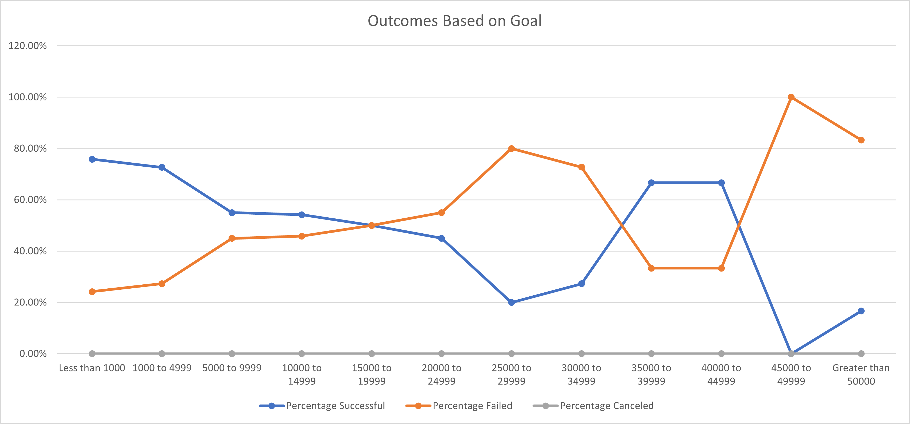

# Kickstarting with Excel

## Overview of Project

### Purpose
This project examines different Kickstarter campaigns and how they performed concerning their launch dates and funding goals.

## Analysis and Challenges

### Analysis of Outcomes Based on Launch Date

I created a pivot table based on the `Parent Category` and `Years` columns. Then, I filtered the `Parent Category` by `Theater` within the pivot table to analyze the theater category. Finally, I created a dotted line chart from the pivot table to visualize the relationship between outcomes and launch month.

To create the `Years` column, I used the `YEAR()` function to extract the year from the `Date Created Conversion` column and placed the data in a new column, `Years`. Then, within the pivot table, I filtered the `Parent Category` by `Theater`  to analyze the theater category.

The line chart shows the number of successful, failed, or canceled projects by month. We can see how each month impacted the fundraising campaign outcome with the line chart visualization:

We can deduce that May is the month with the most successful Kickstarter campaign. However, May, June, July, August, and October also had roughly the same number of failed campaigns.

### Analysis of Outcomes Based on Goals

Based on the funding goal amounts, I created another line chart to visualize the percentage of successful, failed, and canceled plays.

First, I created a sheet labeled "Outcomes Based on Goals" with the following columns:

* Goal
* Number Successful
* Number Failed
* Total Projects
* Percentage Successful
* Percentage Failed
* Percentage Cancelled

Then, I grouped the projects by the following dollar-amount ranges within the "Goals" column:

* Less Than 1,000
* 1,000 to 4,999
* 5,000 to 9,999
* 10,000 to 14,999
* 15,000 to 19,999
* 20,000 to 24,999
* 30,000 to 34,999
* 35,000 to 39,999
* 40,000 to 44,999
* 45,000 to 49,999
* Greater than 50,000

I then populated the number of successful, failed, and canceled projects by utilizing the `COUNTIFS()` function to collect the outcome and goal data of the "plays" subcategory. For example, I used the following function to collect the number of successful plays that had a goal of less than 1000: `=COUNTIFS(Kickstarter!D:D, "<1000", Kickstarter!F:F, "=successful", Kickstarter!R:R, "=plays")`

Next, I calculated the Total Projects by using the `SUM()` function on the range of successful, failed, and canceled projects of each row. I was then able to utilize the sum of projects to determine the percentage of successful, failed, and canceled projects.

Finally, I created a line chart to visualize the relationship between the goal-amount ranges on the x-axis and the percentage of successful, failed, and canceled projects on the y-axis.

We can conclude that there is a relationship between the goal amount and the campaign's success or failure rate. We can deduce that the rate of successful projects will decrease as the funding goal amount increases. However, a few projects successfully launched with a higher budget range between $35,000 to $34,999 and $40,0000 to $44,999. The reasoning for this discrepancy is unclear as the dataset limits us. We could speculate that the projects with the higher goals could have had a higher demand and a better marketing campaign to gather more interest, but we cannot see this with our current dataset.

### Challenges and Difficulties Encountered
It is difficult to find why the budget range of $35,000 to $45,999 had an increase in successful projects. One limitation of the dataset is the total number of projects. Therefore, we can only speculate why this range had an increase of successful campaigns from external factors not included in the dataset.

## Results

- We can deduce that May is the month with the most successful Kickstarter campaign. However, May, June, July, August, and October had roughly the same number of failed campaigns launched.

- We can conclude a relationship between the goal amount and the campaign's success or failure rate. We can deduce that the rate of successful projects will decrease as the funding goal amount increases. However, there were a few that we were able to successfully launch with a higher budget in the range of $35,000 to $34,999 and $40,0000 to $44,999. The reasoning for this discrepancy is unclear as the dataset limits us. We could speculate that the projects with the higher goals could have had a higher demand and a better marketing campaign to gather more interest, but we cannot see this with our current dataset.

- A limitation of this dataset is that we do not have marketing metrics. Therefore, a project may have had a larger marketing budget to increase the amount of sign-up backers for the Kickstarter. Another limitation is that the data does not include detailed information on the donation statistics. We only have access to the average donation. We do not have access to the individual person's data that donated. It would be interesting to investigate how much each person contributed, gender, or age.

- A possible graph that we could create could be a line chart on the project's outcome based on average donation.
